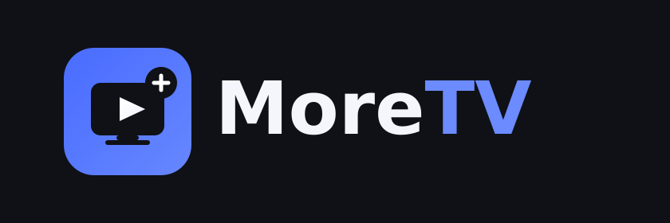

<p align="center">
  
</p>

# MoreTV — Reproductor IPTV multiplataforma

Aplicación de TV para reproducir listas de reproducción **M3U** y portales
**Xtream Codes** (el mismo modelo que ves en apps como TiviMate, IPTV Smarters,
etc.). El objetivo es tener **un núcleo común** y varias "carcasas" nativas para
cada plataforma de TV: Fire TV, Apple TV, Samsung (Tizen), LG (webOS), Roku y
navegador/web.

> ⚠️ **Nota legal importante.** Esta app es solo un **reproductor** (un cliente).
> No aloja ni distribuye canales ni películas. Tú conectas las fuentes de
> contenido para las que **tengas derechos o licencia** (tu propio servidor, un
> proveedor legal, canales FAST gratuitos, contenido propio, etc.). Redistribuir
> canales o películas con derechos de autor sin licencia es ilegal en la mayoría
> de países, y este proyecto no incluye ni facilita ese contenido. Ver
> [`docs/LEGAL.md`](docs/LEGAL.md).

## Por qué esta arquitectura

Los servicios tipo "FutureTV / Bud TV / Flix" son en realidad **dos cosas**:

1. Un **servidor** que aloja/redistribuye el contenido (la parte con riesgo legal).
2. Una **app reproductora** que instala el usuario en su TV.

Este repositorio construye **solo la pieza 2**, que es tecnología estándar y
legítima. El servidor de contenido queda fuera del alcance: debes aportar una
fuente lícita.

## Estructura del monorepo

```
TV app/
├── packages/
│   └── core/            # Núcleo compartido (TypeScript, sin dependencias de plataforma)
│       ├── src/
│       │   ├── types.ts   # Modelos: Playlist, MediaItem, Category, EpgEntry…
│       │   ├── m3u.ts     # Parser de listas M3U/M3U8 extendidas
│       │   ├── xtream.ts  # Cliente de la API Xtream Codes
│       │   └── index.ts
│       └── test/          # Pruebas (node:test) — 10 casos, todos en verde
├── apps/
│   ├── web/             # Fase 1 — App web para TV: navegador + Samsung Tizen + LG webOS
│   │   └── src/           # React + hls.js + navegación por control remoto (D-pad)
│   ├── tv/              # Fase 2 — App React Native: Fire TV + Android TV + Apple TV
│   │   └── src/           # react-native-tvos + react-native-video, reutiliza @tvapp/core
│   └── server/          # Tu servidor M3U/Xtream (Node, sin dependencias)
│       ├── src/           # API Xtream + exportación M3U + redirección de streams
│       └── data/          # catalog.json / users.json (tu contenido y usuarios)
└── docs/
    ├── ARCHITECTURE.md  # Cómo encaja todo
    ├── PLATFORMS.md     # Guía por plataforma (Fire TV, Roku, Apple TV, Tizen, webOS)
    └── LEGAL.md         # Consideraciones legales
```

## Estado actual (v0.1)

- ✅ **Núcleo compartido** con parser M3U y cliente Xtream Codes + pruebas en verde.
- ✅ **Fase 1 — App web para TV** (React): pantalla "Nueva lista de reproducción"
  (M3U/Xtream), navegador de canales con categorías, reproductor HLS y navegación
  por control remoto. Cubre navegador, **Samsung Crystal UHD (Tizen)** y LG (webOS).
  Empaquetado Tizen incluido (`apps/web/tizen/` + `apps/web/TIZEN.md`).
- ✅ **Fase 2 — App React Native para TV** (`apps/tv`): mismas pantallas con UI
  nativa, reproductor nativo (react-native-video) y foco por D-pad. Cubre
  **Fire TV, Android TV / Google TV y Apple TV**, reutilizando `@tvapp/core`.
- ✅ **Contenido** — dos vías, ambas legales para uso personal:
  - **Fuentes gratis** (TV abierta / FAST) como presets de un toque en la app
    (`apps/web/src/sources.ts`, basadas en iptv-org).
  - **Tu propio servidor** M3U/Xtream (`apps/server`): administras tu catálogo en
    un JSON y MoreTV lo refleja y actualiza. Ver `apps/server/README.md`.
- ⏳ Fase 3 — Roku (BrightScript): documentada en `docs/PLATFORMS.md`.

## Cómo correrlo

Requiere Node 22+.

```bash
cd "TV app"
npm install

# Pruebas del núcleo
npm test

# App web en el navegador (simula el TV a 1920x1080)
npm run dev:web
```

Para probar la navegación de TV en el navegador usa las **flechas** del teclado
(D-pad), **Enter** (OK) y **Backspace** (Atrás).

## Estrategia por plataforma (resumen)

| Plataforma                     | Tecnología              | App        | Reutiliza el núcleo   |
| ------------------------------ | ----------------------- | ---------- | --------------------- |
| Navegador / Web                | React + hls.js          | `apps/web` | ✅ directo            |
| **Samsung Crystal UHD (Tizen)**| Empaqueta la app web    | `apps/web` | ✅ directo            |
| LG (webOS)                     | Empaqueta la app web    | `apps/web` | ✅ directo            |
| Amazon Fire TV                 | react-native-tvos       | `apps/tv`  | ✅ vía @tvapp/core    |
| **Android TV / Google TV**     | react-native-tvos       | `apps/tv`  | ✅ vía @tvapp/core    |
| Apple TV (tvOS)                | react-native-tvos       | `apps/tv`  | ✅ vía @tvapp/core    |
| Roku                           | BrightScript/SceneGraph | (fase 3)   | ↻ reimplementa lógica |

Detalle completo en [`docs/PLATFORMS.md`](docs/PLATFORMS.md).
